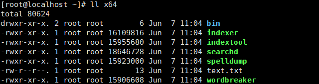
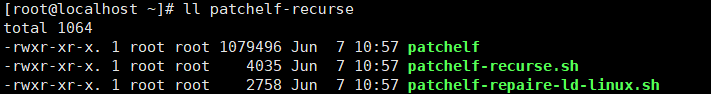
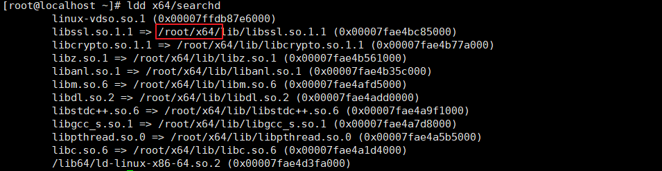
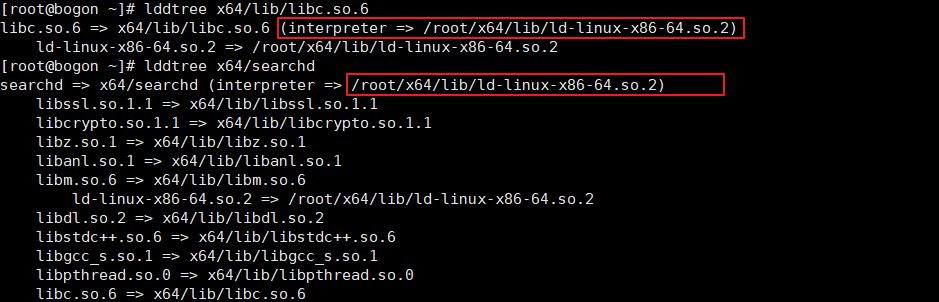
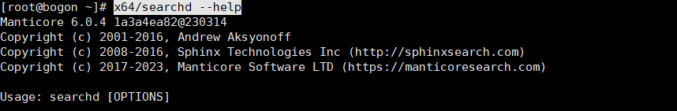

## patchelf-recurse

Combining linux executable programs and dependent dynamic link libraries. 

After using this program, you can port CentOS 8 programs to CentOS 7 for execution. 
In theory, you can even port them to Ubuntu and other systems.

1. Recursive analyze
2. Support folder analyze
3. Solve the problem of ld-linux-x86-64.so.2 dependency


[More information>>>](https://www.javaai.org/a/c892d1e98fd94a64018ff34a0b8b0007)


## Usage example

First, put your application to a directory, like /root/x64:
<p >
  
</p>

<br>
<br>

Then, uncompress patchelf-recurse.tar.gz to /root directory:
<p >
  
</p>

<br>
<br>

Use patchelf-recurse.sh to combine executable application and dynamic libs:<br>

```shell
./patchelf-recurse/patchelf-recurse.sh x64
```

After this, you can see all dynamic lib references become reletive path(looks like absolute path, but actually is reletive path, ldd command will parse reletive path to absolute path for display):


```shell
ldd x64/searchd
```

<p >
  
</p>


<br>
<br>

Copy your application to target machine, and then use the following commands to repaire intepreter:

```shell
./patchelf-recurse/patchelf-repaire-ld-linux.sh x64
```

You muse execute this command on target machine, because interpreter always be absolute path, after you done, you will see the elf file's interpreter becomes absolute path:

<p >
  
</p>

<strong>
Every time you change the application's directory, you must execute patchelf-repaire-ld-linux.sh again, because elf file's interpreter path always be absolute. 
</strong>

<br>
<br>

Enjoy your repaired standalone application: 
<p >
  
</p>


<br>
<br>


